<!--
  ali-novruz / ali-novruz  —  GitHub profile README
  ══════════════════════════════════════════════════════════════
  REQUIRED FILES — commit these next to the README:
    assets/hero.svg      custom animated banner (yours alone, not a generator)
    assets/divider.svg   gradient section rule
  ══════════════════════════════════════════════════════════════
  PALETTE — never introduce a colour outside this list:
    #0D1117  base        #C9D1D9  text
    #39D0D8  cyan        #8B949E  muted
    #58A6FF  blue        #2EA043  success
    #A371F7  violet      #30363D  border
  The cyan→blue→violet gradient is the signature. It runs through the hero,
  every divider, and the header badges — that repetition is what makes the
  page read as one designed object instead of stacked widgets.
  ══════════════════════════════════════════════════════════════
  TODO — RemotePatientMonitoringSystem has no repo description or README on GitHub.
  It carries the whole backend-engineer claim on this page, so it is the single
  highest-value thing left to fix.
-->

  

&nbsp;
&nbsp;
&nbsp;

## &nbsp; About

I build **backend systems for healthcare**, mostly in Java and Kotlin on the Spring stack.
My work sits where distributed systems get uncomfortable: exactly-once delivery, recoverable
workflows, and databases that stay fast when the load doesn't cooperate.

<table border="0"><tr>
<td valign="top" width="50%">

**Right now**
- Remote Patient Monitoring — vitals ingestion at production scale
- DDD · event-driven microservices · observability · CI/CD
- Going deeper: JVM concurrency, coroutines, Postgres planning

</td>
<td valign="top" width="50%">

**Ask me about**
- Kafka delivery semantics and the outbox pattern
- Saga orchestration with compensating actions
- Testcontainers-first CI and contract testing

</td>
</tr></table>

## &nbsp; Featured work

<!--
  Cards are hand-built rather than github-readme-stats pins on purpose: the public
  instance returns 503 under load, and a broken image is worse than no image.
  The star / language / last-commit badges are live shields.io data.
-->

<table border="0">
<tr>
<td width="50%" valign="top">

#### [Remote Patient Monitoring System](https://github.com/ali-novruz/RemotePatientMonitoringSystem)

Ingests continuous vitals from bedside devices and routes them to clinicians in real
time. Transactional outbox for exactly-once delivery; sagas roll back cleanly when a
downstream service dies mid-workflow.

`Spring Boot` `Kafka` `PostgreSQL` `Redis` `K8s`

</td>
<td width="50%" valign="top">

#### [realtime-draft-messenger](https://github.com/ali-novruz/realtime-draft-messenger)

Chat that shows what the other person is typing *before* they hit send. Socket.IO
fan-out for the hot path, Redis for presence and ephemeral drafts, Postgres for
anything that has to survive a restart.

`Next.js` `Socket.IO` `Redis` `PostgreSQL`

</td>
</tr>
<tr>
<td width="50%" valign="top">

#### [autodrive-recorder](https://github.com/ali-novruz/autodrive-recorder)

Background agent that ships OBS and ShadowPlay recordings to Google Drive. Resumable
uploads survive a dropped connection, and a stability check refuses to touch a file
the encoder is still writing to.

`Python` `Google Drive API` `Resumable uploads`

</td>
<td width="50%" valign="top">

#### [live-activity-tool](https://github.com/ali-novruz/live-activity-tool)

Privacy-first agent that streams Windows activity to a portfolio site in real time.
Filtering happens on the client, so the server never receives anything you didn't
explicitly agree to publish.

`Python` `React` `WebSockets`

</td>
</tr>
</table>

<a href="https://github.com/ali-novruz?tab=repositories&sort=stargazers">→ &nbsp;all 10 repositories</a>

 

**Problems I'm working through right now**

| | | | | |
| :--- | :--- | :--- | :--- | :--- |
| **Messaging** | **Workflows** | **Testing** | **Data** | **Ops** |
| Idempotent consumers, outbox + CDC | Sagas with compensating actions | Testcontainers-first CI, contract tests | BTREE/GiST/GIN strategy, Redis Streams | Prometheus metrics, SLO-driven alerting |

## &nbsp; Stack

<table border="0">
<tr>
<td valign="top"><b>LANGUAGES</b></td>
<td>

</td>
</tr>
<tr>
<td valign="top"><b>FRAMEWORKS</b></td>
<td>

</td>
</tr>
<tr>
<td valign="top"><b>DATA</b></td>
<td>

</td>
</tr>
<tr>
<td valign="top"><b>INFRA</b></td>
<td>

</td>
</tr>
<tr>
<td valign="top"><b>QUALITY</b></td>
<td>

</td>
</tr>
</table>

## &nbsp; Activity

&nbsp;
&nbsp;

  

<picture>
  <source media="(prefers-color-scheme: dark)" srcset="https://streak-stats.demolab.com?user=ali-novruz&hide_border=true&border_radius=10&background=0D1117&ring=58A6FF&fire=A371F7&currStreakNum=C9D1D9&sideNums=8B949E&currStreakLabel=58A6FF&sideLabels=8B949E&dates=8B949E" />
  <source media="(prefers-color-scheme: light)" srcset="https://streak-stats.demolab.com?user=ali-novruz&hide_border=true&border_radius=10" />
  
</picture>

  

<picture>
  <source media="(prefers-color-scheme: dark)" srcset="https://github-readme-activity-graph.vercel.app/graph?username=ali-novruz&bg_color=0D1117&color=58A6FF&line=A371F7&point=39D0D8&title_color=58A6FF&area=true&area_color=1F6FEB&hide_border=true&radius=10" />
  <source media="(prefers-color-scheme: light)" srcset="https://github-readme-activity-graph.vercel.app/graph?username=ali-novruz&theme=github-light&hide_border=true&radius=10" />
  
</picture>

<!--
  DELIBERATELY NOT HERE — both were verified broken on 2026-08-08:
    github-readme-stats.vercel.app   → 503 SERVICE_UNAVAILABLE (public instance is saturated)
    github-profile-trophy.vercel.app → failed to load
  If you want the stats card back, fork and deploy your own instance, then swap the host:
    gh repo fork anuraghazra/github-readme-stats --clone
  Self-hosted URLs are not rate-limited and will not 503 on your profile.
-->

## &nbsp; Connect

 

  

&nbsp;
&nbsp;
&nbsp;
&nbsp;
&nbsp;

  

<picture>
  <source media="(prefers-color-scheme: dark)" srcset="https://raw.githubusercontent.com/ali-novruz/ali-novruz/output/github-contribution-grid-snake-dark.svg" />
  <source media="(prefers-color-scheme: light)" srcset="https://raw.githubusercontent.com/ali-novruz/ali-novruz/output/github-contribution-grid-snake.svg" />
  
</picture>

<i>Thanks for stopping by.</i>

